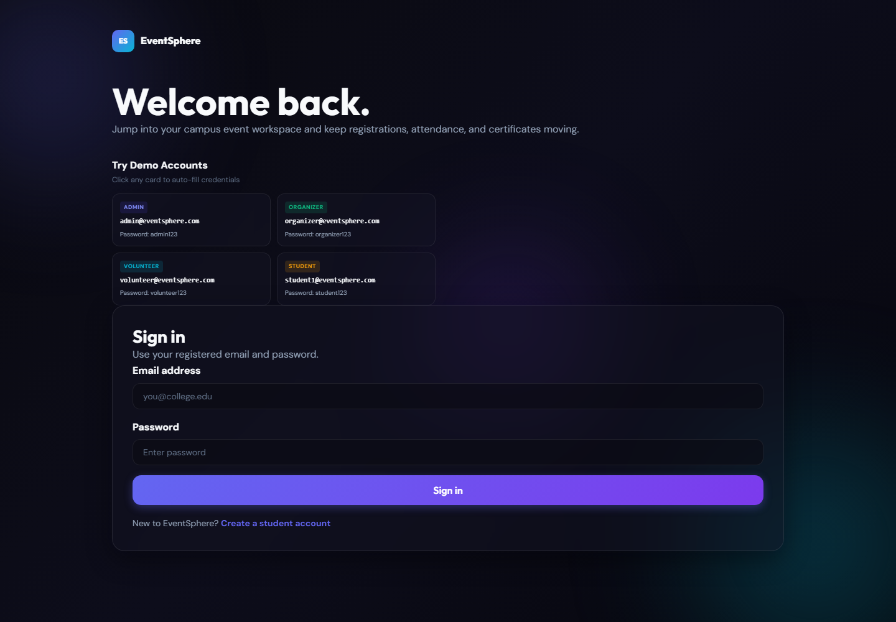
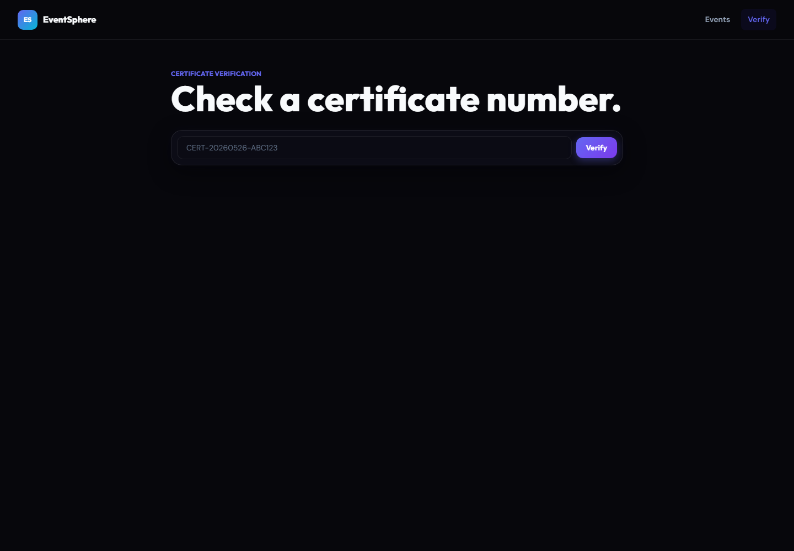

# EventSphere

EventSphere is a Spring Boot web application for college event operations. It supports public event discovery, role-based dashboards, registrations, attendance tracking, feedback, notifications, and verifiable certificate workflows.

## Features

- Public landing page, event catalog, event details, contact page, and certificate verification.
- Role-based access for admins, organizers, volunteers, and students.
- Event creation, publishing, registrations, waitlists, attendance, feedback, and certificate records.
- Seed data for demo and local review, controlled by `APP_SEED_ENABLED`.
- Docker Compose deployment with MySQL and optional phpMyAdmin.
- CI workflow that runs Maven tests and packages the application.

## Tech Stack

- Java 17
- Spring Boot 3.2
- Spring Security 6
- Spring Data JPA and Hibernate
- Thymeleaf
- MySQL 8
- Maven
- Docker

## Screenshots

Screenshots are stored in [docs/screenshots](docs/screenshots).

| Page | Preview |
| --- | --- |
| Home |  |
| Events |  |
| Login |  |
| Certificate verification |  |

## Quick Start

### Prerequisites

- Java 17+
- Maven 3.8+
- MySQL 8+

### Local MySQL Setup

Create a database:

```sql
CREATE DATABASE eventsphere_db CHARACTER SET utf8mb4 COLLATE utf8mb4_unicode_ci;
```

Set the database connection with environment variables:

```powershell
$env:SPRING_DATASOURCE_URL="jdbc:mysql://localhost:3306/eventsphere_db?useSSL=false&serverTimezone=UTC&allowPublicKeyRetrieval=true"
$env:SPRING_DATASOURCE_USERNAME="root"
$env:SPRING_DATASOURCE_PASSWORD="your-password"
```

Run the app:

```powershell
mvn spring-boot:run
```

Open:

```text
http://localhost:8080/eventsphere
```

## Docker Deployment

Copy the environment template and edit passwords before deploying outside local development:

```powershell
Copy-Item .env.example .env
```

Start the stack:

```powershell
docker compose up -d --build
```

Open:

```text
http://localhost:28080/eventsphere
```

Optional phpMyAdmin:

```powershell
docker compose --profile tools up -d phpmyadmin
```

Open:

```text
http://localhost:28081
```

Useful commands:

```powershell
docker compose ps
docker compose logs -f app
docker compose logs -f db
docker compose down
docker compose down -v
```

## Configuration

Common environment variables:

| Variable | Default | Purpose |
| --- | --- | --- |
| `SERVER_PORT` | `8080` | Spring Boot server port inside the container or local process. |
| `SERVER_SERVLET_CONTEXT_PATH` | `/eventsphere` | Application base path. |
| `SPRING_DATASOURCE_URL` | Local MySQL URL | JDBC connection string. |
| `SPRING_DATASOURCE_USERNAME` | `root` locally, `eventsphere` in Docker | Database user. |
| `SPRING_DATASOURCE_PASSWORD` | empty locally | Database password. |
| `SPRING_JPA_HIBERNATE_DDL_AUTO` | `update` | Hibernate schema strategy. |
| `APP_SEED_ENABLED` | `true` | Enables demo users, events, registrations, and certificates. |
| `FILE_UPLOAD_DIR` | `uploads/` | Local upload directory. |

For production, set strong database credentials, consider setting `APP_SEED_ENABLED=false`, and manage schema changes with migrations or reviewed SQL.

## Demo Accounts

When seed data is enabled, these demo users are created:

| Role | Email | Password |
| --- | --- | --- |
| Admin | `admin@eventsphere.com` | `admin123` |
| Organizer | `organizer@eventsphere.com` | `organizer123` |
| Volunteer | `volunteer@eventsphere.com` | `volunteer123` |
| Student | `student1@eventsphere.com` | `student123` |

## Tests and Build

Run the automated test suite:

```powershell
mvn test
```

Build the deployable jar:

```powershell
mvn clean package
```

The packaged application is created under `target/`.

## Project Structure

```text
src/main/java/com/eventsphere
  config/       Spring and seed configuration
  controller/   MVC controllers
  dto/          Form and transfer objects
  entity/       JPA entities
  repository/   Spring Data repositories
  security/     User-details integration
  service/      Business services
  validation/   Custom validators

src/main/resources
  static/       CSS and JavaScript assets
  templates/    Thymeleaf views
  application.properties
  application-docker.properties
  schema.sql
```

## Deployment Notes

- Build artifacts, local `.env` files, IDE settings, logs, and uploads are ignored by git.
- The Docker image runs as a non-root `eventsphere` user.
- Docker Compose stores MySQL data and uploaded files in named volumes.
- The CI workflow runs `mvn test` and `mvn -DskipTests package` on pushes and pull requests.
- Public routes include `/`, `/events`, `/about`, `/contact`, `/certificate-verify`, and `/auth/**`.

## Troubleshooting

Database connection errors:

- Confirm MySQL is running and reachable.
- Check `SPRING_DATASOURCE_URL`, `SPRING_DATASOURCE_USERNAME`, and `SPRING_DATASOURCE_PASSWORD`.
- For Docker, inspect `docker compose logs -f db`.

Port conflicts:

- Change `SERVER_PORT` for local runs.
- Change `APP_PORT`, `MYSQL_PORT`, or `PHPMYADMIN_PORT` in `.env` for Docker.

Template or static asset issues:

- Confirm templates are under `src/main/resources/templates`.
- Confirm static files are under `src/main/resources/static`.

## License

This project is currently provided as coursework/demo software. Add a `LICENSE` file before publishing it as open source.
